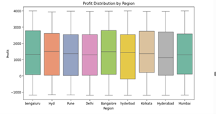
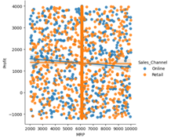
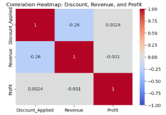

# Nike-sales-analysis
Machine learning analysis of Nike sales data using Python, EDA, and predictive modeling

## Objectives
- Analyze sales trends and patterns
- Identify key drivers of revenue and profit
- Build predictive models for forecasting

## Tools & Technologies
- Python (Pandas, NumPy, Scikit-learn)
- Data Visualization (Matplotlib, Seaborn)
- Machine Learning Models
## Key Insights
- Strong positive relationship between Units Sold and Revenue
- Discounts have limited impact on profit
- Regional variations significantly affect sales performance

## Project Structure
- `data/` → Dataset files  
- `notebooks/` → Jupyter notebooks  
- `images/` → Visualizations  

## Future Improvements
- Deploy interactive dashboard (Power BI / Tableau)

  ## 📊 Visual Insights

### Profit Distribution by Region

Profit varies significantly across regions, indicating location-based performance differences.

### MRP vs Profit Relationship

Positive relationship between price and profit across sales channels.

### Correlation Heatmap

Revenue and profit show strong correlation, while discount impact is weaker.
- Implement advanced models (XGBoost)

---

 **Author:** Alice Mataruse  
MS Business Analytics (Applied AI)
